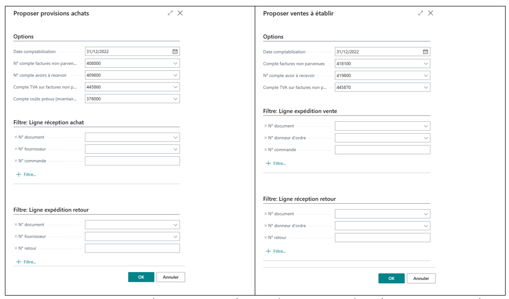
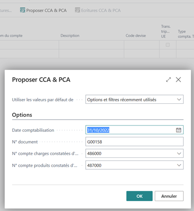
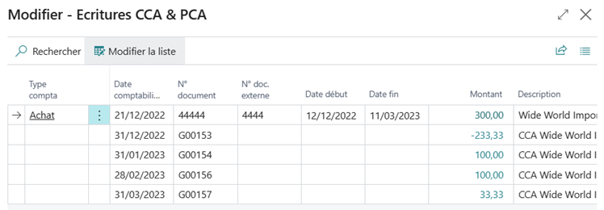
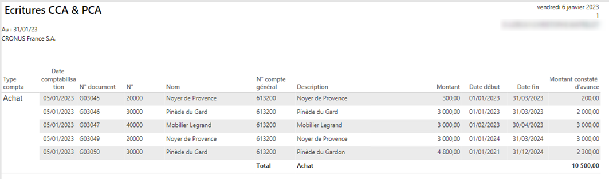

# Extension WanaClose
Certaines opérations doivent être renouvelées à chaque arrêté comptable (ou Cut-off), qu’il s’agisse d’une fin d’exercice ou d’une situation intermédiaire.

Les fonctions ci-après viennent compléter les fonctions standards proposées à cet effet.

> Ce n’est que l’une des extensions gracieusement mises à votre disposition (voir [Extensions | Wanamics](https://www.wanamics.fr/extensions-business-central/Extensions)).  
Vous pouvez donc en disposer librement dans le cadre de la licence open source qui vous est accordée (voir [Licence Open Source | Wanamics](https://www.wanamics.fr/licence-open-source/)).

### Sommaire
- [Factures non parvenues (réceptions non facturées)](#factures-non-parvenues-réceptions-non-facturées)
- [Charges et produits constatés d’avance (CCA / PCA)](#charges-et-produits-constatés-davance-cca--pca)
  - [Feuille de saisie](#feuille-de-saisie)
  - [Ecritures comptables](#ecritures-comptables)
  - [Proposer CCA \& PCA](#proposer-cca--pca)
  - [Détail de la répartition](#détail-de-la-répartition)
  - [Exemples](#exemples)
  - [Etat](#etat)
  - [Documents achats et ventes](#documents-achats-et-ventes)
  - [Fonctions connexes](#fonctions-connexes)
  - [Impact sur le modèle de données](#impact-sur-le-modèle-de-données)

## Factures non parvenues (réceptions non facturées)

La valorisation des stocks et la comptabilisation par la fonction **Valider coûts ajustés** relèvent des fonctions standards (voir en particulier quelques articles à ce sujet sur www.wanamics.fr) selon la méthode de l’inventaire permanent.

La méthode préconisée consiste à ne pas valoriser les réceptions non facturées (coûts prévus), qui n’ont donc pas lieu d’en être déduites.

En fin d’exercice, il convient cependant d’en tenir compte conformément aux normes comptables françaises (impact 408).

De plus, il faut tenir compte des achats hors articles (lignes de **Type** *Compte général* ou *Ressource*, voire *Immobilisation*).

Une **Feuille abonnement** est utilisée à cet effet et permettra, lors de la validation de reprendre cette provision au premier jour de la période suivante.

Outre les factures non parvenues (FNP), il est tenu compte des avoirs à recevoir (AàR ou retours fournisseurs dont l'avoir reste attendu).

Une fonction similaire s’applique aux ventes pour les factures à établir (FàE ou expéditions non facturées), et les avoirs à établir (AàE ou retours clients).

Attention : les lignes ainsi proposées ne doivent pas être validées plusieurs fois à la même date et pour la même sélection. En revanche il est possible de procéder en plusieurs sélections distinctes et validations successives, par exemple pour dissocier les transactions intragroupe.

## Charges et produits constatés d’avance (CCA / PCA)
**Contexte**

La fonction standard d’échelonnement permet de répartir une écriture dans la durée dès la validation d’une écriture. Elle s’applique aux documents d’achats et de vente ainsi qu’à la feuille de saisie.

La répartition dans la durée se base sur la **Date comptabilisation** de l’écriture initiale et sur un **Code échelonnement** (hérité de l’article, de la ressource ou du compte général et modifiable).

Elle présente quelques contraintes :

* Il n’est pas possible de préciser une date de début différente de la **Date comptabilisation**.
* Les périodes comptables doivent être définies sur la durée de la répartition.
* Il n’est pas possible de déroger aux codes échelonnements configurés (date de début, nombre de périodes).
Les fonctions décrites ci-après proposent une solution plus souple, et peu impactante.

### Feuille de saisie
Les colonnes **Date début** et **Date fin** sont ajoutées aux feuilles de saisie Achats et Ventes :

**Remarques**
* La **Date début** et la **Date fin** sont indissociables.
* La **Date fin** doit bien sûr être postérieure ou égale à la **Date début**.
* La **Date début** peut être sur une période (voire exercice) postérieure à la **Date comptabilisation** (année suivante par exemple), mais également sur une période antérieure (comptabilisation tardive ou facture à terme échu).
* Elles ne sont prises en compte que pour des lignes de **Type compta TVA** (ou **Type compta. TVA contrepartie**) *Achat* ou *Vente* (mais seront sans incidence sur la TVA proprement dite).
* Si le compte est configuré avec un **Modèle échelonnement par défaut** dont le **Nombre de périodes** n’est pas défini, les **Date début** et **Date fin** sont obligatoires.
A l’inverse, les **Date début** et **Date fin** sont incompatibles avec un autre **Modèle échelonnement par défaut**.

### Ecritures comptables
La consultation des écritures comptables, est complétée des colonnes **Date début** et **Date fin** (à ajouter par **Personnaliser**, pas de filtre ou de tri sur ces colonnes) :

Les **Date début** et **Date fin** peuvent y être modifiées et seront prises en compte lors du prochain calcul des CCA/PCA (le **Type compta. TVA** de l’écriture doit être *Achat* ou *Vente*).

### Proposer CCA & PCA
La feuille comptabilité est complétée d’une action **Proposer CCA & PCA** :

**Remarques**
* Pour la feuille de saisie utilisée, l’option **Copier paramètres TVA sur les lignes feuille** ne doit pas être activée.
* La **Date comptabilisation** doit coïncider avec la fin d’une période comptable.

### Détail de la répartition
Depuis une ligne de la feuille de saisie, ou depuis la consultation des écritures comptables, l’action **Ecritures CCA & PCA** permet d’afficher les écritures liées (celle d’origine ainsi que les écritures de CCA & PCA déjà comptabilisées). Cette action est inactive (grisée) s’il ne s’agit pas d’une écriture de PCA/CCA.

### Exemples

Voici quelques exemples de comptabilisation des charges constatées d’avance pour des factures de même montant (300€) sur la même durée (3 mois) comptabilisées à la même date (21/04) mais avec des dates de début/fin différentes :

|Cas|Date compta| Montant|Début| Fin |au 30/04|au 31/05|au 30/06|au 31/07|
|:-:|:---------:|-------:|:---:|:---:|-------:|-------:|-------:|-------:|
| 1	|  21/04    | 300,00 |01/04|30/06| -200,00|  100,00| 100,00	|   0,00 | 
| 2	|  21/04    | 300,00 |15/04|14/07| -250,00|  100,00| 100,00	|  50,00 | 
| 3	|  21/04    | 300,00 |01/05|31/07| -300,00|  100,00| 100,00	|  100,00| 
| 4	|  21/04    | 300,00 |01/01|31/03|        |        |        |        | 
| 5	|  21/04    | 300,00 |01/02|30/04| -100,00|  100,00|        |        |

**Remarques**
* Le montant proposé est calculé par différence entre le montant total des CCA/PCA à la date sélectionnée et le montant des CCA/PCA antérieures déjà validées pour la même écriture d’origine. Si le traitement est relancé à la même date, aucune variation n’est constatée et les écritures ne sont donc plus proposées.
* Si la **Date comptabilisation** est postérieure ou égale à la **Date fin**, le montant proposé correspond donc au solde des PCA/CCA.
* Si l’écriture d’origine a été comptabilisée à une date postérieure à la **Date fin** (ex : facturation à terme échu), elle n’est pas prise en compte.
* Si la date de début ne coïncide pas avec un début de mois, la première période est calculée au prorata temporis.
* Les mois suivants sont de même montant (quel que soit leur nombre de jours).
* Le dernier mois solde les CCA/PCA antérieurs et reprend donc l’arrondi le cas échéant.
* Les imputations comptables et analytiques sont celles de l’écriture d’origine.
* * L’écriture de contrepartie (au compte de CCA/PCA) est centralisée et ne reprend donc pas les imputations analytiques.
Cependant, si l’écriture d’origine concerne un partenaire inter-société, la contrepartie est validée ligne à ligne (via la colonne **N° compte contrepartie) et rattachée à celui-ci (**Code partenaire IC**).

### Etat
Il a pour but de justifier le solde des comptes de charges et produits constatés d’avance.

Il faudra donc veiller à utiliser des comptes dédiés à cet effet.

### Documents achats et ventes
Les **Date début** et **Date fin** peuvent également être saisies sur les lignes de factures et avoirs (à ajouter par **Personnaliser**).

Des écritures distinctes seront générées pour des lignes relatives à des périodes distinctes.

Ces dates sont également affichées sur les factures et avoirs enregistrés.

Elles sont prises en compte lors de la copie d’un document ainsi qu’en cas d’extourne (ou Corriger).

De même, elles sont prises en compte si un document est archivé ou restauré.

### Fonctions connexes

|||
|:--------------------------|:-------------------------------------------------------|
|Extourne écriture origine | L’extourne reprend également les CCA/PCA correspondantes tout en restant liée à l’écriture d’origine.|
|Extourne écriture CCA/PCA | Décrémente le montant de CCA/PCA qui sera donc de nouveau proposé lors du prochain calcul.|
|Facture achat/vente, copier document, corriger/annuler, archiver/restaurer | Non implémenté à ce jour. A envisager sur base de la nouvelle méthode de validation annoncée pour la version 21.3 (via table 55 **Invoice Posting Buffer** et non table 49 **Invoice Post. Buffer**) qui permettra une distinction des écritures validées par date début/fin.|
|Projets | Toute imputation à un projet requiert un **N° tâche projet**, mais celui-ci n’est pas repris sur l’écriture comptable. Dès lors, il ne peut être proposé lors du traitement des CCA & PCA, et devra le cas échéant être complété manuellement.|

### Impact sur le modèle de données
Lors de la validation, les dates de début/fin sont enregistrées dans une table distincte, mais liées à l’écriture comptable concernée (par le **N° séquence écriture comptable**).

La validation des lignes de CCA & PCA enregistre dans cette même table les écritures ainsi liées.

Une extension de la table des écritures comptables aurait pénalisé toutes les autres requêtes sur cette dernière (du fait d’une jointure), et une clé supplémentaire aurait été nécessaire pour optimiser le traitement **Proposer CCA & PCA**.